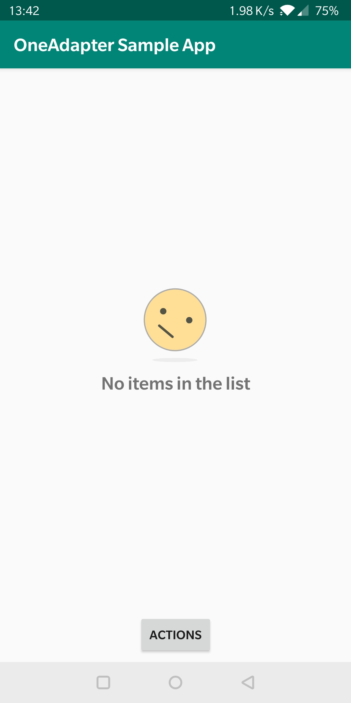
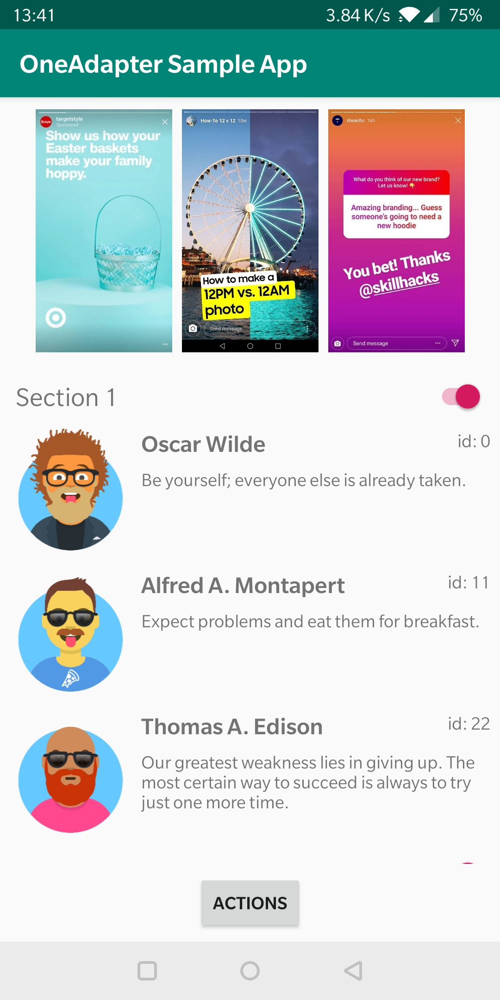
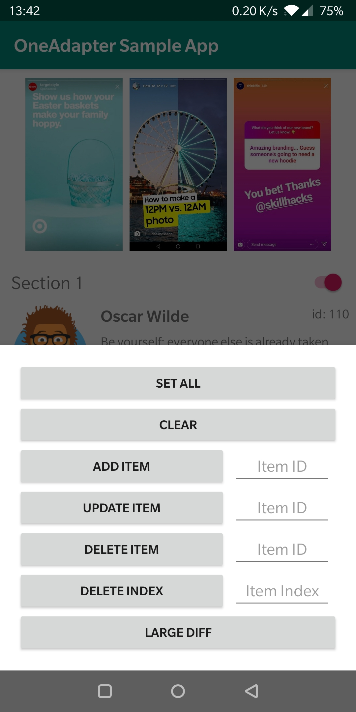
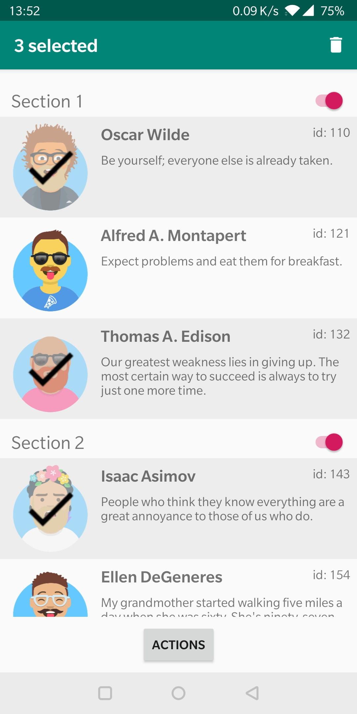

# OneAdapter 
[  ](https://bintray.com/ironsource-aura/OneAdapter/oneadapter/_latestVersion)
[](https://android-arsenal.com/details/1/7824)
[](https://androidweekly.cn/android-dev-weekly-issue-242/)

OneAdapter is made to simplify and enhance the use of the RecyclerView's Adapter while preventing common mistakes. 
With multiple modules and hooks, you don't have to think about writing an adapter anymore, and just focus on what matters. 

For better understanding what drove me to write this library and what use cases it solves best, please refer to my Medium post:
https://medium.com/@idanatsmon/adapting-your-recyclerview-the-2019-approach-e47edf2fc4f3

## What's new:
Version 2.0.0 is out with a brand new Kotlin API!<br/>
Check the example below or sample project for reference

## Features:
- Modular approach for more reusable and testable code
- Built-in support for DiffUtil (using [Diffable](#2-implement-diffable))
- Optimized performance - internal processing done on a background thread
- 100% written in Kotlin with Kotlin friendly API using DSLs
- [Modules:](#modules)
  - [Item Module](#basic-usage)
  - [Paging Module](#paging-module)
  - [Emptiness Module](#emptiness-module)
  - [Selection Module](#selection-module)
- [Event Hooks:](#event-hooks)
  - [Click Event Hook](#click-event-hook)
  - [Swipe Event Hook](#swipe-event-hook)
- [Others:](#others)
  - [First Bind Animation](#first-bind-animation)
  - [Data Binding](#data-binding)


# Include in your project
```groovy
dependencies {
  implementation "com.ironsource.aura.oneadapter:oneadapter:${LATEST_VERSION}"
}
```

Note that library interfaces and API may change slightly while the library design matures.<br/>
Please see the changes in the CHANGELOG file before upgrading.


# Preview
## Example
You can try out the [example project](https://github.com/idanatz/OneAdapter/tree/develop/sample) that includes basic and advanced usage in Kotlin.
## Screenshots
   

<br/><br/>
# Basic Usage
### 1. Implement Item Module
Item Modules are used for the creation and binding of all ViewHolders for you. In the onBind method, you will receive as a parameter the model associated with this view and a ViewBinder class that lets you find (and cache) the views defined in the associated layout file.

```kotlin
class MessageModule : ItemModule<MessageModel>() {
    init {
        config {
            layoutResource = R.layout.message_model
        }
        onBind { model, viewBinder, metadata ->
            val title = viewBinder.findViewById<TextView>(R.id.title)
            title.text = model.title
        }
        onUnbind { model, viewBinder, metadata ->
            // unbind logic like stop animation, release webview resources, etc.
        }
    }
}
```
### 2. Implement Diffable
The Adapter is calculating the difference between its current data and the modified data on a background thread and posting the result to the main thread. In order for this magic to work without writing tons of DiffUtil.Callback, your models need to implement one simple interface:
```kotlin
class MessageModel : Diffable {
    private val id: Long = 0L
    private val title: String? = null

    override val uniqueIdentifier: Long = id
    override fun areContentTheSame(other: Any): Boolean = other is MessageModel && title == other.title
}
```
### 3. Attach To OneAdapter & Use
```kotlin
val oneAdapter = OneAdapter(recyclerView) {
    itemModule += MessageModule()
} 
oneAdapter.setItems(...) 
```

<br/><br/>
# Advanced Usage
## Modules
### Multiple Types
Have more than one view type? not a problem, just create another ItemModule and attach it to OneAdapter in the same way.
#### 1. Implement Multiple Item Modules
```kotlin
class MessageModule : ItemModule<MessageModel> { ... }
class StoryModule : ItemModule<StoryModel> { ... }
```
#### 2. Attach To OneAdapter
```kotlin
val oneAdapter = OneAdapter(recyclerView) {
    itemModule += MessageModule()
    itemModule += StoryModule()
    ...
}
```

<br/><br/>
### Paging Module
Paging Module is used for creating and binding a specific ViewHolder at the end of the list when the Adapter reaches a load more state. The visible threshold configuration is used to indicate how many items before the end of the list the onLoadMore callback should be invoked.
<br/></br>

<br/>
#### 1. Implement Paging Modules
```kotlin
class PagingModuleImpl : PagingModule() {
    init {
        config {
            layoutResource = R.layout.load_more // can be some spinner animation
            visibleThreshold = 3 // invoke onLoadMore 3 items before the end
        }
        onLoadMore { currentPage ->
            // place your load more logic here, like asking the ViewModel to load the next page of data.
        }
    }
}
```
#### 2. Attach To OneAdapter
```kotlin
val oneAdapter = OneAdapter(recyclerView) {
    // itemModule += ...
    pagingModule = PagingModuleImpl()
}
```

<br/><br/>
### Emptiness Module
Emptiness Module is used for creating and binding a specific ViewHolder when the Adapter has no data to render.
<br/></br>

<br/>
#### 1. Implement Emptiness Modules
```kotlin
class EmptinessModuleImpl : EmptinessModule() {
    init {
    	config {
            layoutResource = R.layout.empty_state
        }
        onBind { viewBinder, metadata -> ... }
        onUnbind { viewBinder, metadata -> ... }
    }
}
```
#### 2. Attach To OneAdapter
```kotlin
val oneAdapter = OneAdapter(recyclerView) {
    // itemModule += ...
    emptinessModule = EmptinessModuleImpl()
}
```

<br/><br/>
### Selection Module
Selection Module is used for enabling single or multiple selection on Items.
<br/></br>

<br/>
#### 1. Implement Selection Modules
```kotlin
class ItemSelectionModuleImpl : ItemSelectionModule() {
    init {
    	config {
            selectionType = SelectionType.Multiple // Or SelectionType.Single
        }
        onStartSelection {
            // place your general selection logic here, like changing the toolbar text to indicate the selected count.
        } 
        onUpdateSelection { selectedCount -> ... }
        onEndSelection { ... }
    }
}
```
#### 2. Implement Selection State
```kotlin
class MessageModule : ItemModule<MessageModel>() {
    init {
        // config, onBind, etc...
        
        states += SelectionState<MessageModel>().apply {
            config {
                enabled = true // decide if the selection should be enabled for this model, true by default
            }
            onSelected { model, selected ->
                // insert your selected logic here. 
                // right after this call you will receive an onBind call in order to reflect your changes on the relevant Item Module.
            }
        }
    }
}
```
#### 3. Attach To OneAdapter
```kotlin
val oneAdapter = OneAdapter(recyclerView) {
    itemModule += MessageModule()
    itemSelectionModule = ItemSelectionModuleImpl()
}
```

<br/><br/><br/>
## Event Hooks
Item Modules can easily be enhanced with event hooks to get access to common events like clicking or swiping on an item.

### Click Event Hook
Click Hook can be attached in order to recieve click events on an item.
<br/></br>

<br/>
#### 1. Implement Click Event Hook
```kotlin
class MessageModule : ItemModule<MessageModel>() {
    init {
        // config, onBind, etc...
        
        eventHooks += ClickEventHook<MessageModel>().apply {
            onClick { model, viewBinder, metadata -> 
                // place your on click logic here. 
            }
        }
    }
}
```
#### 2. Attach To OneAdapter
```kotlin
val oneAdapter = OneAdapter(recyclerView) {
    itemModule += MessageModule()
}
```

<br/><br/>
### Swipe Event Hook
Swipe Hook can be attached in order to receive swiping (during and when completed) events on an item.
<br/></br>

<br/>
#### 1. Implement Swipe Event Hook
```kotlin
class MessageModule : ItemModule<MessageModel>() {
    init {
        // config, onBind, etc...
        
        eventHooks += SwipeEventHook<MessageModel>().apply {
            config {
                swipeDirection = listOf(SwipeEventHook.SwipeDirection.Start, SwipeEventHook.SwipeDirection.End)
            }
            onSwipe { canvas, xAxisOffset, viewBinder ->
                // draw your swipe UI here.
                // like painting the canvas red with a delete icon.
            }
            onSwipeComplete { model, viewBinder, metadata ->
                // place your swipe logic here.
                // like removing an item after it was swiped right.
            }
        }
    }
}
```
#### 2. Attach To OneAdapter
```kotlin
val oneAdapter = OneAdapter(recyclerView) {
    itemModule += MessageModule()
}
```

<br/><br/><br/>
## Others

### First Bind Animation
The provided Animator will be animated on the first bind of the corresponding ItemModule's models. 
<br/></br>

<br/>
```kotlin
class MessageModule : ItemModule<MessageModel>() {
    init {
        config {
            layoutResource = R.layout.message_model
            
            // can be implemented by inflating Animator Xml
			firstBindAnimation = AnimatorInflater.loadAnimator(this@FirstBindAnimationActivity, R.animator.item_animation_example)
			
			// or can be implemented by constructing ObjectAnimator
            firstBindAnimation = ObjectAnimator().apply {
                propertyName = "translationX"
                setFloatValues(-1080f, 0f)
                duration = 750
            }
        }
        onBind { model, viewBinder, metadata -> ... }
    }
}
```

### Data Binding
Built in support for Android Data Binding (https://developer.android.com/topic/libraries/data-binding)
Full example is provided in the example project.
```kotlin
class MessageModule : ItemModule<ObservableMessageModel>() {
    init {
        config {
            layoutResource = R.layout.message_model
        }
        onBind { model, viewBinder, metadata ->
            viewBinder.dataBinding?.run {
                setVariable(BR.messageModel, model)
                lifecycleOwner = this@DataBindingActivity
                executePendingBindings()
            }
        }
    }
}
```

<br/><br/>
# License
Copyright (c) 2019 Idan Atsmon

Permission is hereby granted, free of charge, to any person obtaining a copy
of this software and associated documentation files (the "Software"), to deal
in the Software without restriction, including without limitation the rights
to use, copy, modify, merge, publish, distribute, sublicense, and/or sell
copies of the Software, and to permit persons to whom the Software is
furnished to do so, subject to the following conditions:

The above copyright notice and this permission notice shall be included in all
copies or substantial portions of the Software.

THE SOFTWARE IS PROVIDED "AS IS", WITHOUT WARRANTY OF ANY KIND, EXPRESS OR
IMPLIED, INCLUDING BUT NOT LIMITED TO THE WARRANTIES OF MERCHANTABILITY,
FITNESS FOR A PARTICULAR PURPOSE AND NONINFRINGEMENT. IN NO EVENT SHALL THE
AUTHORS OR COPYRIGHT HOLDERS BE LIABLE FOR ANY CLAIM, DAMAGES OR OTHER
LIABILITY, WHETHER IN AN ACTION OF CONTRACT, TORT OR OTHERWISE, ARISING FROM,
OUT OF OR IN CONNECTION WITH THE SOFTWARE OR THE USE OR OTHER DEALINGS IN THE
SOFTWARE.
